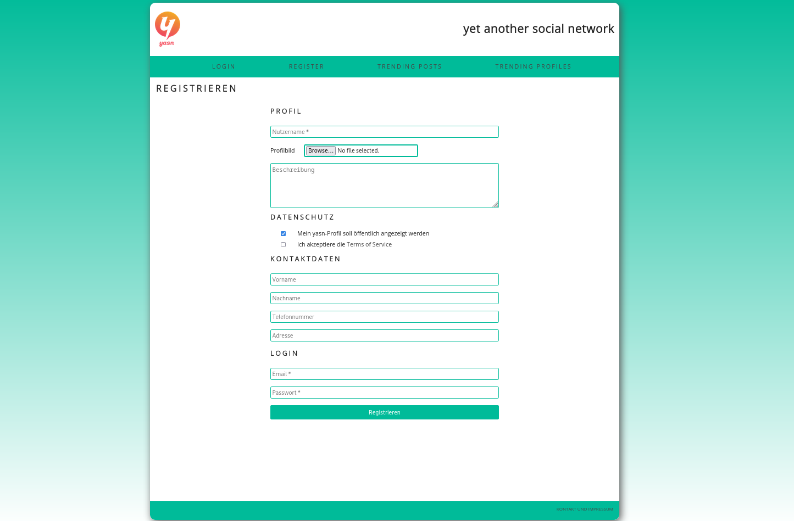
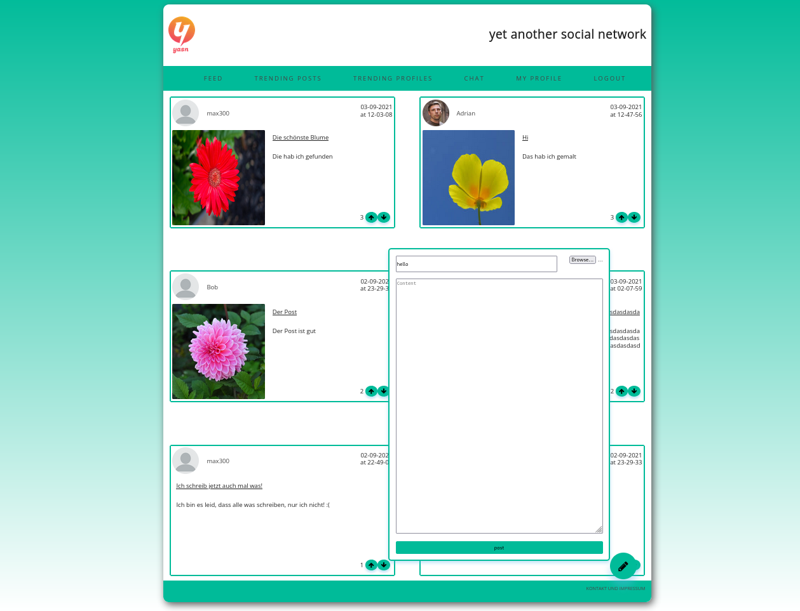
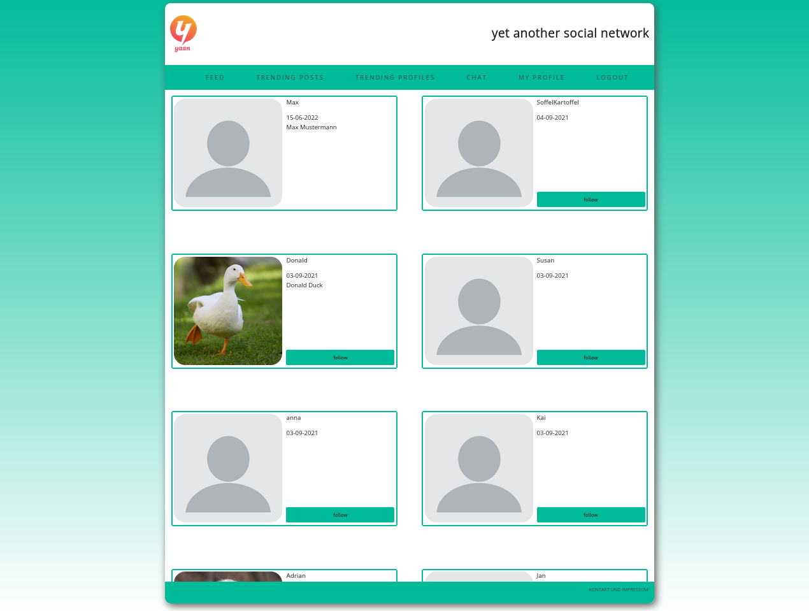

# yasn

yasn (yet another social network) began as an exercise during a course
at [SAP](https://www.sap.com/germany/index.html).

yasn is written in PHP and uses a relational database model for organized storage
of user data. In my implementation I used `mariadb` as an mySQL implementation.

## running

```shell
$ git clone https://github.com/Sebastian-Heinzenburger/yasn.git
$ sudo php -S 0.0.0.0:80
```

## preview

### register
There is a selection of optional and required fields needed for registration. \
Users can also upload custom profile pictures which will be stored in the
server file system.
The passwords are stored as [salted hashes](https://www.php.net/manual/en/function.password-hash).



### feed
The posts can contain either an image or just text. \
Posts are sorted by their upvote score. When the user presses upvote
the browser communicates seamlessly with the server through a [JSON api](https://jsonapi.org/)
allowing for data manipulation without having to resort to basic
HTTP methods which would require a page reload.



### profiles




